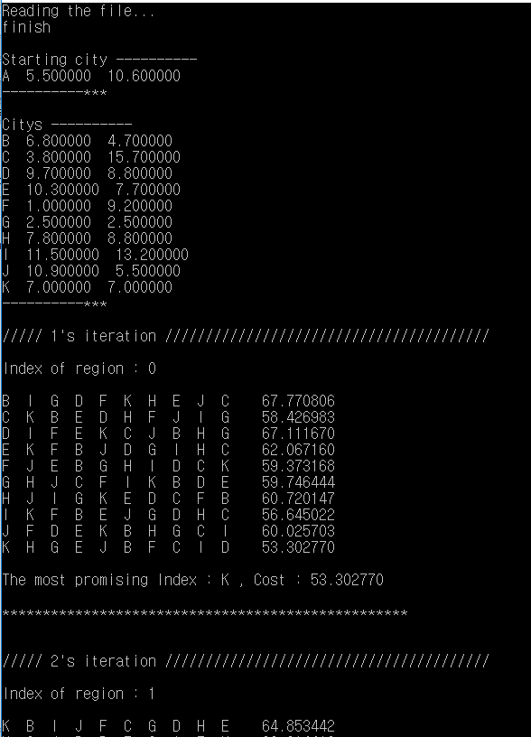

# NPinC
#### An implementation of Nested Partition Algorithm for TSP problem in C  

### Description
This program solves Traveling Salesman Problem using Nested Partition.
> Nested Partitions Method for Global Optimization  
> [10.1287/opre.48.3.390.12436](https://pubsonline.informs.org/doi/10.1287/opre.48.3.390.12436)  

The algorithm, in short, gets the local optimum as selecting the subregion with the optimal cost step by step. The input is a textfile containing 2-dimension coordinates of "cities" to go through. It determines the several routes randomly, and choose the _promising_ route for the total distance. With determining the next city gradually, in need, the selected city could be canceled due to the other _promising_ trajectory. The final result is the optimal order of cities and its distance.  
  
### Input
"Citys.txt" is the input textfile. Each line consists of the city name, longitude, and latitude. It assumes that the first line is the start.  
  
### Details
* **Head of an example**  
&nbsp;  
  
&nbsp;  
First, it shows the list of cities and the coordinates. In the NP method, it shows _Index of region_, _the random routes and distance_, and _the promising region_. The _Index of region_ is the depth of the subregion. In this case, K is the most promising next city on the optimal cost.  
&nbsp;  
* **Body of an example**  
&nbsp;  
  
&nbsp;  
If the randomly generated route without K is the most promising, then the K is unselected and back to the previous depth. In 3rd iteration, the first city K is replaced with F. As the depth is deeper, the number of the randomly generated route without the selected cities is larger.  
&nbsp;  
* **Rear of an example**  
&nbsp;  
  
&nbsp;  
Finally, the most promising trajectory is compared with the random routes. And this program shows the final order and the cost.
